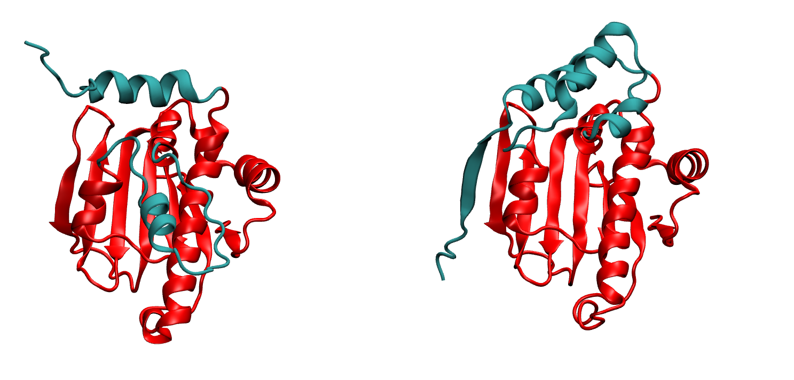
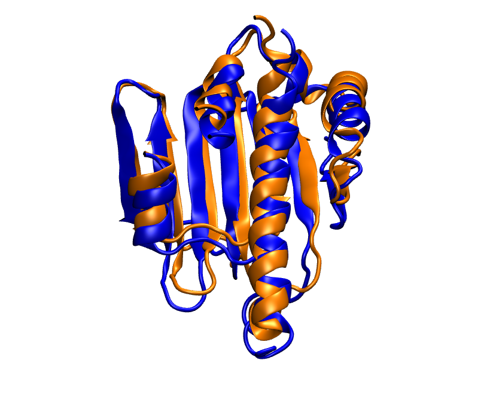
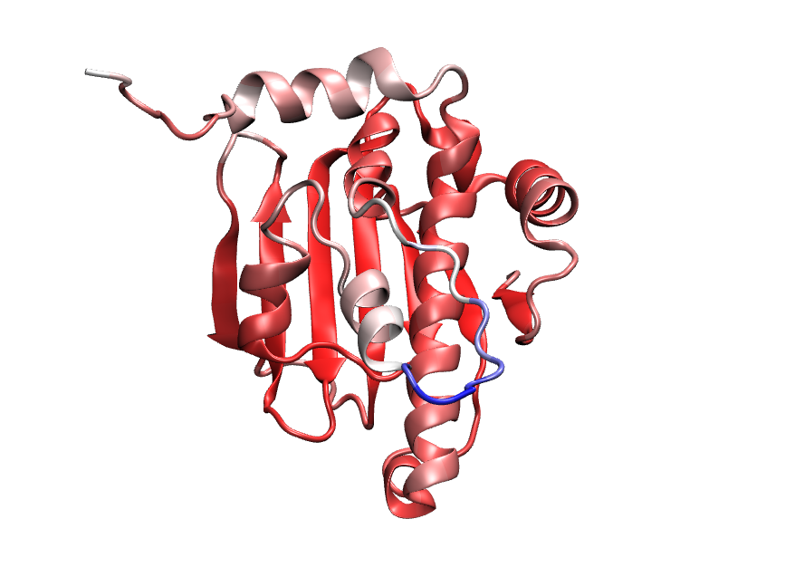
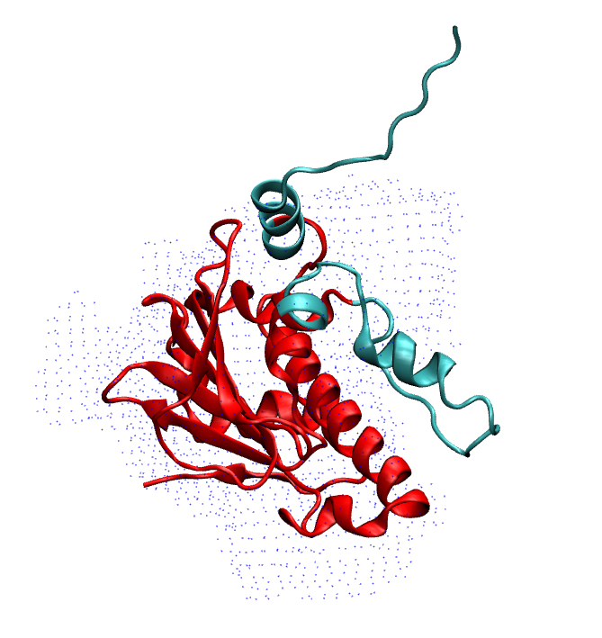
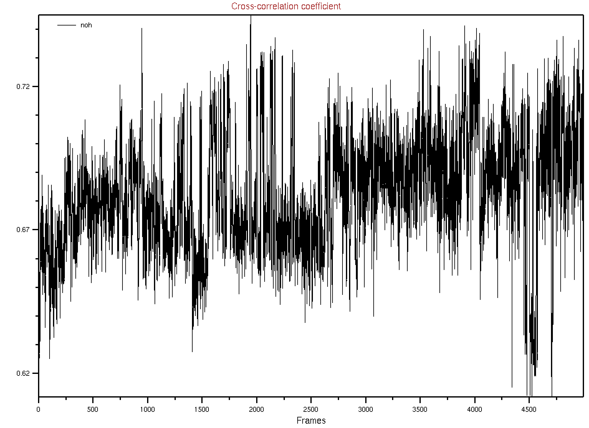

===========================================================
Refining AF2 prediction with MELD using Cryo-EM density map 
===========================================================

Introduction
============
Here, in this tutorial, we will show how to refine an AF2 prediction with MELD simulation. We will use Cryo-EM map to extract the best strucutre from MELD generated ensemble. For this particular case we have choose heat shock protein system with known experimental structure *2xhx.pdb* (RCSB-PDB code 2xhx). This is a 213 residue protein starting from res 11 to res 223. AF2 is used first to predict the folded stucture from sequence (thanks to John from Singharoy Group at ASU and Dr. Rowley at Carleton University) and protocol can be found elsewhere. The provided prediction (*AF-P07900-F1-model_v1_short.pdb*) has residue 16 to 223 and it mostly looks pretty good except two region, shown below:

On the left we have the native structure and on the right we have ALphaFold2 prediction. The part matching well with expermental structure is shown in Red color and the parts that do not match, are shown in Cyan. From residue 109 to 136 the loop has different secondary structure and the orientation is incorrect and at the terminal from res 16 to 40, the prediction is missing the beta sheet pairing. Rest of the protein match well:

Here we are only showing the part that matches well. In blue we have native and in orange we have the prediction.

We looked at the per residue confidence score for the model prediction AF2. The scores correlate well with the quality of the predicted structure:

Here, as score increases color changes from blue--> white --> red. In other words blue represent the lower score and Red represent the higher score. Notice, the region which do not match with native, mostly have blue, white or faded red color. Also some hehix-turn have faded red color. 

Also if we look at the superposition of the prediction on map, these two region are not fitting well. They are sticking out of the density map:

To refine/remodel these region, we run MELD simulation starting from the AF2 prediction. We put cartesian restraint on the coordinate of CA atom in the region where the confidence score is higher that 90% and no restraint for less that 90%. We can find this score in the second last column in *AF-P07900-F1-model_v1_short.pdb* file.

Starting conformation for MELD simulation
==========================================

To run MELD simulation, first we need to install MELD in the cluster. Instruction for Conda installation of MELD is given in the github page. Once we have MELD installed successfully, we then need to minimize AF2 predicted model with AMBER. Before that, we used tleap to generate topology and coordinate file using *tleap.in* file. We execute this as:

*tleap -f tleap.in*

This returns *system.top* and *system.mdcrd* files and we minimize the coordinate with *minimize_GPU.sh*. This returns minimized coordinate *eq0_template.rst* which can be converted to a pdb file:

*ambpdb -p system.top -c eq0_template.rst >minmized.pdb*

The *minimized.pdb* is moved to *TEMPLATES/* directory.

Now as we have the starting conformation, we are reasy to submit MELD simulation.

Configuring the MELD simulation
==========================================

To configure the MELD simulation we use a python script *setup_MELD.py*

First we need to import the libraries:

.. code-block:: python
    
    import numpy as np
    from meld.remd import ladder, adaptor, leader
    from meld import comm, vault
    from meld import system
    from meld import parse
    import meld.system.montecarlo as mc
    from meld.system.restraints import LinearRamp,ConstantRamp
    from collections import namedtuple
    import glob as glob

Then we define some parameter:

.. code-block:: python

     N_REPLICAS = 16       # Number of replicas
     N_STEPS = 5000        # Number of steps will be saved. This is equivalent to 250 ns.
     BLOCK_SIZE = 100      # We save the trajectory in a chunk of 100 frames.
     
Then define a couple of function to generate the replica states and enforce the restraints:

.. code-block:: python

     def gen_state_templates(index, templates):                                                                                                                                     
         n_templates = len(templates)
         print((index,n_templates,index%n_templates))
         a = system.ProteinMoleculeFromPdbFile(templates[index%n_templates])
         #Note that it does not matter which forcefield we use here to build
         #as that information is not passed on, it is used for all the same as
         #in the setup part of the script
         b = system.SystemBuilder(forcefield="ff14sbside")
         c = b.build_system_from_molecules([a])
         pos = c._coordinates
         c._box_vectors=np.array([0.,0.,0.])
         vel = np.zeros_like(pos)
         alpha = index / (N_REPLICAS - 1.0)
         energy = 0
         return system.SystemState(pos, vel, alpha, energy,c._box_vectors)
     # Restraints on Protein CA
     def make_cartesian_collections(s, scaler, residues, delta=0.2, k=250.):  # provides 2 angstrom of flexibility and energy increasing beyond that with 250 kJ/(mol.nm**2) force constant.
         cart = []
         backbone = ['CA']
         #Residues are 1 based
         #index of atoms are 1 base
         for i in residues:
              # print i
             for b in backbone:
                 # print b
                 atom_index = s.index_of_atom(i,b) - 1
                 x,y,z = s.coordinates[atom_index]/10.
                 rest = s.restraints.create_restraint('cartesian',scaler, LinearRamp(0,15,0,1),res_index=i, atom_name=b,
                                    x=x, y=y, z=z, delta=delta,force_const=k)
                 cart.append(rest)
          return cart
Now setup the other important parameter and call these functions:

.. code-block:: python

     def setup_system():
         #print "!!!Starting from Templates!!!"
         templates = glob.glob('TEMPLATES/*.pdb')          # reading the initial conformation from TEMPLATE directory.
         # build the system
         p = system.ProteinMoleculeFromPdbFile(templates[0])      # building the system
         b = system.SystemBuilder(forcefield="ff14sbside")        # adding force field "ff14sbsude is combination of  ff14SB backbone and ff99SB sidechain force field
         s = b.build_system_from_molecules([p])
         s.temperature_scaler = system.GeometricTemperatureScaler(0, 0.4, 300, 500.) # setup temperature replica ladders. 1st replcia has 300K and then increasing geometrically and become 500k at 6th replica (16*0.4~6) and then from 6th to 16th it remains 500K.
         n_res = s.residue_numbers[-1]
         const_scaler = s.restraints.create_scaler('constant')  # define a constant scaler, does not chnage throuout the replcia ladder
         pro_res = list(range(26,91)) + list(range(121,151))+list(range(154,163))+list(range(165,193))+list(range(199,209))   # Region of the protein which has higher than 90% confidence score. Here there residue numbers are shifted by 15, as not our template pdb starts from res 1 instead of res 16. so template is from res 1 to res 208.
         print(pro_res)
         # Keep protein close to starting conformation
         rest = make_cartesian_collections(s, const_scaler, pro_res)        # enforce cartesian restraint  on this region with high score. notice constant scaler is used. so the restrant is equally strong at all the replicas since we do not want to unfold the protein at hightemperature relicas.
         s.restraints.add_as_always_active_list(rest)
             # create the options
         options = system.RunOptions()
         options.implicit_solvent_model = 'gbNeck2'        #implicit solvent gbNeck2 model
         options.use_big_timestep = False
         options.use_bigger_timestep = True
         options.cutoff = 1.8
         options.use_amap = False
         options.amap_alpha_bias = 1.0
         options.amap_beta_bias = 1.0
         options.timesteps = 11111           #We save 1 frame in each 11111 frames, i.e. every 50 ps  
         options.minimize_steps = 20000
         options.min_mc = None
         options.run_mc = None
         # create a store
         store = vault.DataStore(s.n_atoms, N_REPLICAS, s.get_pdb_writer(), block_size=BLOCK_SIZE)
         store.initialize(mode='w')
         store.save_system(s)
         store.save_run_options(options)
         # create and store the remd_runner
         l = ladder.NearestNeighborLadder(n_trials=100)
         policy = adaptor.AdaptationPolicy(2.0, 50, 50)
         a = adaptor.EqualAcceptanceAdaptor(n_replicas=N_REPLICAS, adaptation_policy=policy)
         remd_runner = leader.LeaderReplicaExchangeRunner(N_REPLICAS, max_steps=N_STEPS, ladder=l, adaptor=a)    #launching replica exchange
         store.save_remd_runner(remd_runner)
         # create and store the communicator
         c = comm.MPICommunicator(s.n_atoms, N_REPLICAS)
         store.save_communicator(c)
          # create and save the initial states
          #states = [gen_state(s, i) for i in range(N_REPLICAS)]
         states = [gen_state_templates(i,templates) for i in range(N_REPLICAS)]
         store.save_states(states, 0)
         #sve data_store
         store.save_data_store()
         return s.n_atoms
    setup_system()     
     
Now we have the *setup_MELD.py* file and we will execute it 

*python setup_MELD.py*

THis would generate a *Data/* directory in the working directory and it this point we are ready to submit it to remote clusters.

The job can be started with the following command:

*srun --mpi=pmix_v3 /home/arup/miniconda3/envs/meld_conda/bin/launch_remd*   

Ideally we need to submit this on a cluster. *job.sh* will help to do that. but the headers and the path have to be changed depending on the users.

*sbatch job.sh*
THis will start generating *remd.log* file once the job starts and it will take about 8-10 hours in  astandard machines.

Now when the job is done, we extract the lowest temperature replcia.

*extract_trajectory extract_traj_dcd --replica 0 trajectory.00.dcd*          # to extract the 1st temperature replica i.e. lowest temperature replica

Since the trajectory is very large, we put it in onedrive:
https://uflorida-my.sharepoint.com/:u:/g/personal/arup_mondal_ufl_edu/EX-BiN3kDFlPjZwjn7N6808BGhO80HUtKkbt8Zz7FkgBuQ?e=Og6SI2

*trajectory.00.dcd* will have 5000 frames. To extract the best structures from this ensembles, we can several analyss e.g. clustering, RMSD compared to native and etc.

For this particular example we used density map and calculated the cross-corelation of our trajectory with the map in VMD. The real map *2xhx_potential-map.dx* is not a Cryo-EM map, this is generated them X-ray crystallography. This continuing map is tricky to work with. So here we used a simulated map. Simulated map *2xhx-sim.dx* was calculated using the native structure. 

In VMD we used we loaded our trajectory *trajectory.00.dcd* along with topology file and then calculated cross corellation:

*mdff check -ccc -map 2xhx-sim.dx -res 4 -cccfile "ccc.dat"*

This will give the following map and *ccc.dat* file.

We the sorted the valued of correlation *corr-sorted.dat* and from this we get frame 1942 has the highest correlation values. We extracted this frame *from_density_1942.pdb* from the whole trajectory and it now matching well with the native, the loop is rearranged properly and the terminal also forming the beta-strand pairing. (we reformateted the native with tleap as *2xhx_short_leap.pdb* in order to have similar residue numbering whihch helps to align them in VMD easily)

.. image:: MELD.png 
     :width: 450

.. image:: MELD1.png
     :width: 450

In the first image, on the right we have the native and on the left we have MELD prediction. Overlap has been shown in the second image.

Just to verify, this prediction fits really in the density map we are provided.

.. image:: pred_map.png
     :width: 450
