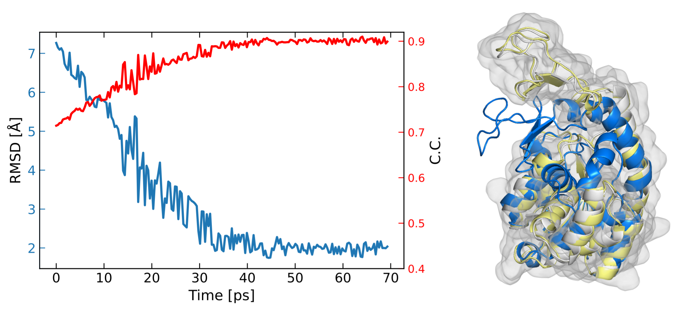

======================================================
Integrative modeling with cryo-EM data
======================================================

In this tutorial, we describe how to set up simulation with cryo-EM data in MELD using adenylate kinase as an example.

Input preparation
-------------------

To set up cryo-EM guided simulation in MELD, we first build the system given a PDB file.
Here we use the closed form of adenylate kinase (PDB: `1AKE <https://www.rcsb.org/structure/1AKE>`_) as the initial conformation.
For the target cryo-EM map, we use the generated density map from its open conformation (PDB: `4AKE <https://www.rcsb.org/structure/4AKE>`_).
We provide a gaussian kernel based density map builder :code:`pdb_map` in :code:`process_density_map`

.. code-block:: python

    process_density_map pdb_map -f ./4ake_t.pdb --map_save --sigma 2 -d .

where the :code:`sigma` determines the simulated resolution of the map to be :math:`2*\sigma`. `[1] <https://www.sciencedirect.com/science/article/pii/S0006349508819868?via%3Dihub>`_

System setup
-------------------

Now we can set up the simulation with the following:

.. code-block:: python
    
    N_REPLICAS = 8              #number of replicas
    N_STEPS = 2000              #number of steps for each replica
    BLOCK_SIZE = 20             #number of steps for saving trajectory

    template = "./1ake_s.pdb"                           
    p = meld.AmberSubSystemFromPdbFile(template)                   
    build_options = meld.AmberOptions(                             
        forcefield="ff14sbside",                                     
        implicit_solvent_model="gbNeck2",                            
        use_big_timestep=True,                                       
        cutoff=1.8*u.nanometer                                       
    )                                                              
    builder = meld.AmberSystemBuilder(build_options)               
    s = builder.build_system([p]).finalize()        #create system selected build options               
    s.temperature_scaler = meld.ConstantTemperatureScaler(300.0 * u.kelvin)     #set up temperature scaler

In this example, we use :code:`ff99SB` force field with :code:`ff14sbside` correction and :code:`gbNeck2` implicit solvent model. See :ref:`Getting Started with MELD` for more options.

Then we can add restraints based on density map to the system. Given a density map, a grid based potential can be defined as:

.. math:: 
    V_{\mathrm{EM}}(\mathbf{r})= \begin{cases}\zeta\left(1-\frac{\phi(\mathbf{r})-\phi_{\mathrm{thr}}}{\phi_{\mathrm{max}}-\phi_{\mathrm{thr}}}\right), & \Phi(\mathbf{r}) \geq \Phi_{\mathrm{thr}} \\ \zeta, & \Phi(\mathbf{r})<\Phi_{\mathrm{thr}}\end{cases}

where :math:`\Phi(\mathbf{r})` is the density value at position :math:`\mathbf{r}`, 
:math:`\Phi_{\mathrm{thr}}` is the threshold for the density dataset to exclude solvent 
data with low density values. $\zeta$ is a scale factor to control the strength of density 
map potential and also defines a flat potential for the solvent region. :math:`\Phi_{\max }=\max (\Phi(\mathbf{r}))`, 
which is designed to drive atoms into the high density region with low potential energy. 
The total energy :math:`\mathrm{t}` of the system is given by :math:`U_\mathrm{t} =  U_\mathrm{ff}+U_\mathrm{EM}+U_\mathrm{add}`, 
where :math:`U_\mathrm{EM} = \sum_{i} w_{i} V_{\mathrm{EM}}\left(\mathbf{r}_{i}\right)` with :math:`w_{i}` usually being the 
mass of atom :math:`i` and :math:`U_\mathrm{add}` can be additional restraints such as secondary structure restraints.
For high resolution maps, we can smooth the generated grid potential by a Gaussian kernel 
to reduce the resolution of the map to alleviate the problem of atoms being trapped in a local minima 
of the rugged energy surface.

Following the replica exchange framework in MELD, we first create a :code:`blur_scaler`
to blur the density map. Here we use a linear blur function to blur the map from 0 to 2 such that we will
use the original density map for the first replica and increasingly blur the map for the rest of replicas.
:code:`constant_blur` is another option to define density map restraints with same blurring scale for all replicas.
The restraints can now be defined based on selected atoms in the system. 

.. code-block:: python
    
    blur_scaler = s.restraints.create_scaler(
        "linear_blur", alpha_min=0, alpha_max=1, 
        min_blur=0, max_blur=2, num_replicas=N_REPLICAS
    )

    for i in range(len(s.residue_numbers)):     #select non-hydrogen atoms in the system
        if "H" not in s.atom_names[i]:
            all_atoms.append(s.index.atom(resid=s.residue_numbers[i],atom_name=s.atom_names[i]))

    density_map=s.density.add_density('./4ake_t_s2.mrc',blur_scaler,0,0.3)
    r = s.restraints.create_restraint(
        "density",
        dist_scaler,
        LinearRamp(0,100,0,1),
        atom=all_atoms,        
        density=density_map
    )
    map_restraints.append(r)
    s.restraints.add_as_always_active_list(map_restraints)   #add restraints to the system  

Next we can set up the parameters for replica exchange simulation. 

.. code-block:: python

    # set run options with 100 steps for exchange and 100 steps for minimization
    options = meld.RunOptions(
        timesteps = 100,
        minimize_steps = 100
    )
    # set up the data store
    store = vault.DataStore(gen_state(s,0), N_REPLICAS, s.get_pdb_writer(), block_size=BLOCK_SIZE)
    store.initialize(mode='w')
    store.save_system(s)
    store.save_run_options(options)
    
    # create and store the remd_runner
    l = ladder.NearestNeighborLadder(n_trials=100)
    policy = adaptor.AdaptationPolicy(2.0, 50, 50)
    a = adaptor.EqualAcceptanceAdaptor(n_replicas=N_REPLICAS, adaptation_policy=policy)
    
    remd_runner = leader.LeaderReplicaExchangeRunner(N_REPLICAS, max_steps=N_STEPS, ladder=l, adaptor=a)
    store.save_remd_runner(remd_runner)
    
    # create and store the communicator
    c = comm.MPICommunicator(s.n_atoms, N_REPLICAS)
    store.save_communicator(c)
    
    # create and save the initial states
    states = [gen_state(s, i) for i in range(N_REPLICAS)]                    
              
    store.save_states(states, 0)
                                                                             
    # save data_store
    store.save_data_store()

The complete script can be found `here <https://github.com/ccccclw/meld/blob/master/docs/tutorial/cryofold_tutorial/setup_cryofold.py>`_.

If the simulation is run on multiple GPUs, we can use :code:`mpirun -n 8 launch_remd --debug`, 
or we can use :code:`mpirun -n 1 launch_remd --debug` to run the simulation on a single GPU. 

Result analysis
------------------
After simulation is done, we can use :code:`extract_trajectory` to extract frames 
saved in :code:`Data/`. The options can be seen from :code:`extract_trajectory --help`

For example, we can extract frames from 1 to 200 of replica 0 in :code:`.dcd` format. 

.. code-block:: python
    
    extract_trajectory extract_traj_dcd --start 1 --end 200 --replica 0 trajectory.00.dcd 

We can analyze the result based on the cross correlation between synthetic density maps of the simulation 
and target density map using

.. code-block:: python

    process_density_map pdb_map -f ./1ake_s.pdb -t trajectory.00.dcd -m ./4ake_c1.mrc --cc_save --cc -d .

From the correlation coefficient result, we can see that the initial conformation (blue) is progressively
refined against the target map during the simulation. Representative conformation of high c.c. (yellow) is aligned against native structure (white).

    Correlation coefficient between synthetic density maps of simulation and target density map.
