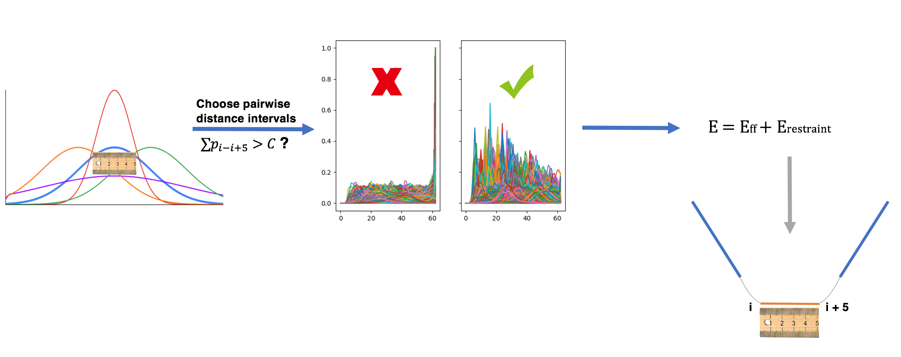

===========================================
Integrate histogram data in MELD simulation
===========================================

In this tutorial, we show how to analyze histogram data and guide simulation as external force in MELD. The central idea is illustrated by
the following figure using predicted protein residue-residue pairwise distance histogram data. 

Loading Some Helpful Modules
----------------------------
.. code-block:: python

import numpy as np
from meld.remd import ladder, adaptor, leader
from meld import comm, vault
from meld import system
from meld import parse
import meld.system.montecarlo as mc
from meld.system.restraints import LinearRamp,ConstantRamp
from collections import namedtuple
import glob as glob
from simtk.openmm import unit as u 

Setting up the system
----------------------
.. code-block:: python

# build the system
sequence = parse.get_sequence_from_AA1(filename='sequence.dat')  #sequence.dat contains the sequence of system
p = system.ProteinMoleculeFromSequence(sequence)
b = system.builder.SystemBuilder(forcefield="ff14sbside")
s = b.build_system([p])
# select temparature for replicas
s.temperature_scaler = system.temperature.GeometricTemperatureScaler(0, 0.4, 400.0 * u.kelvin, 550.0 * u.kelvin)

Analysis histogram data
-----------------------

As illustrated in Fig.1, for each histogram, we first evalute where the sum of density over 
a certain range (5 :math:`\AA` here) is larger than threshold (0.8 here), which indicates the most possible distance range between two residues. 
An example analysis script is provided in analyze_distograms.py. After this step, we should obtain pairwise distance information like the following:

    0 CB 12 CB 14.3     
    
    0 CB 27 CB 14.0
    
    0 CB 28 CB 15.3
    ...
The first line indicates the predicted lower bound distance is 14.3 :math:`\AA` and upper bound is 14.3+5 :math:`\AA`.

Integrate processed histogram data in MELD
------------------------------------------
For each processed histogram, we convert it into a flat-bottom harmonic restraints, where the restraints between lower bound and upper 
bound is set to be 0 and will have restraints penalty larger than 0 outside of this range.
Here we provide examples of deriving distance restraints and dihedral restraints that are common in protein structure prediction.

.. code-block:: python

#generate distance restraints 
def get_distogram(filename, s, scaler):
    dists = []
    rest_group = []                                                                                                                                                       
    lines = open(filename).read().splitlines()
    lines = [line.strip() for line in lines]
    for line in lines:
        if not line:
            dists.append(s.restraints.create_restraint_group(rest_group, 1))
            rest_group = []
        else:
            cols = line.split()
            i = int(cols[0])
            name_i = cols[1]
            j = int(cols[2])
            name_j = cols[3]
            dist = float(cols[4]) / 10.
            r1 = dist -0.2
            if r1 < 0:
                r1 = 0.0
            rest = s.restraints.create_restraint('distance', scaler,LinearRamp(0,100,0,1),
                                                  r1=r1*u.nanometer, r2=dist*u.nanometer, 
                                                  r3=(dist+0.5)*u.nanometer, r4=(dist+0.7)*u.nanometer, 
                                                  k=700*u.kilojoule_per_mole / u.nanometer ** 2,
                                                  atom1=s.index.atom(i, name_i),atom2=s.index.atom(j, name_j))
            rest_group.append(rest)
    return dists

distogram = get_distogram('contacts.dat',s,scaler=NMR_scaler) #contacts.dat file contains processed distance histogram data like the above
s.restraints.add_selectively_active_collection(distogram, int(len(distogram)*0.8)) #we trust 80% of predicted pairwise distance data

#generate dihedral restraints 
torsion_rests = []
for line in open('phi.dat','r'):         #phi.dat file contains processed dihedral histogram data
    cols = line.split()
    res = int(cols[0])
    atoms = [s.index.atom(res-1, 'C'),s.index.atom(res, 'N'),s.index.atom(res, 'CA'),s.index.atom(res, 'C')]
    phi_avg = float(cols[1])
    phi_sd = 50
    phi_rest = s.restraints.create_restraint('torsion', dist_scaler,
                                             phi=phi_avg * u.degree, delta_phi=phi_sd * u.degree, 
                                             k=0.1*u.kilojoule_per_mole / u.degree ** 2,
                                             atom1=atoms[0], atom2=atoms[1], atom3=atoms[2], atom4=atoms[3])
    torsion_rests.append(phi_rest)
s.restraints.add_selectively_active_collection(torsion_rests, int(len(torsion_rests)*0.8))

